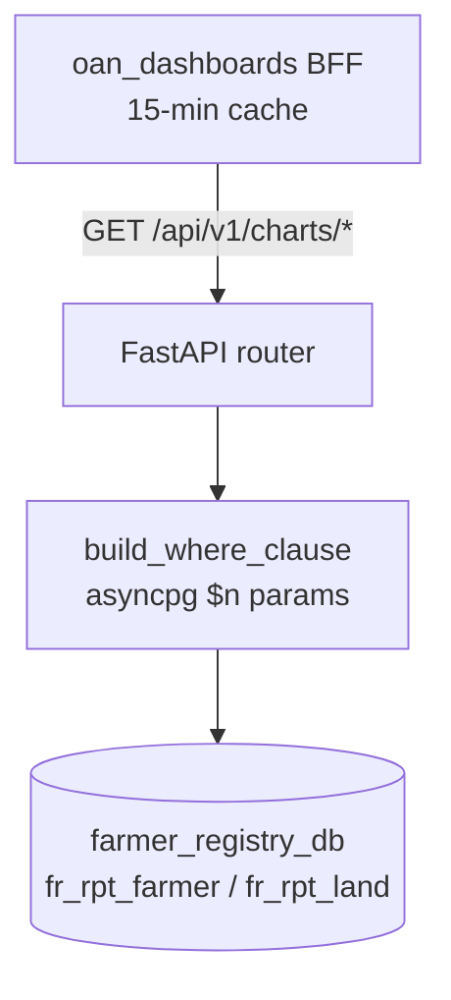

# farmer-registry-dashboard-api

Read-only FastAPI service that serves aggregate chart data for the GEN2 Farmer Registry dashboard
([oan_dashboards](https://github.com/Centre-for-Open-Societal-Systems/oan_dashboards)). It reads
only the registry's materialized reporting views, `fr_rpt_farmer` and `fr_rpt_land`.

**Design:** `oan_dashboards/docs/farmer-registry-dashboard-design.md` ·
**Contributor / agent guide:** [AGENTS.md](AGENTS.md)



## Endpoints

`GET /api/v1/charts/<chartId>` returns a JSON array of rows. Every chart accepts `region`, `zone`,
`woreda`, `kebele` (bare code or full level value id), `farmingType` and `recordState`. Without
`recordState`, only `ACTIVE` records are counted.

| Chart | Rows |
| --- | --- |
| `farmerKpis` | totals, gender split, land size, owned land |
| `farmersByRegion`, `farmersByGender`, `farmersByType`, `farmersByAgeAndGender`, `farmersByEducation`, `farmersByRecordState` | distributions |
| `landTenureSplit` | parcels and hectares by tenure (per parcel) |
| `registryTrendByMonth` | farmers, total and owned area per `YYYY-MM` |
| `registryCoverage` | covered units per level; totals from `GEO_LEVEL_TOTALS` |
| `farmersByPsnpStatus`, `farmersByImportStatus` | `[]` (not in GEN2 yet) |

`GET /health` runs `SELECT 1`.

## Configuration

See `.env.example`: `DATABASE_URL` (required), `ALLOWED_ORIGINS`, `GEO_LEVEL_TOTALS`, `API_V1_STR`.

## Security

- Every filter value is bound as an asyncpg parameter; there is no string interpolation of input.
- There is no authentication. Expose the service only to the dashboard BFF, never publicly.

## Development

```bash
make dev                       # uvicorn --reload on :8005
docker compose up -d --build   # container on :8005
pip install -r requirements-dev.txt
make test                      # pytest against a throw-away schema (TEST_DATABASE_URL)
make lint
```
