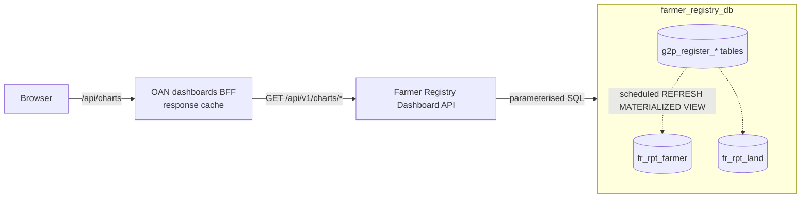

# Architecture

## Purpose

The OAN dashboards show registry-wide statistics: how many farmers are registered, where they are,
and how much land they hold under which tenure. The statistics are computed over the whole register
and filtered by geography and a few attributes. This service computes them and returns them as small
JSON arrays shaped for the dashboard charts.

## Position in the system



| Component | Owner | Role |
| --- | --- | --- |
| OAN dashboards BFF | `oan_dashboards` | The only client. Caches each chart and filter combination and serves the browser |
| Dashboard API (this service) | this repository | Validates filters, builds parameterised SQL, returns aggregates |
| Reporting views | farmer registry | Per-farmer and per-parcel rollups of the register, refreshed on a schedule |
| Register tables | farmer registry | Source of truth. This service never reads them directly |

## Request lifecycle

1. The BFF calls `GET /api/v1/charts/<chartId>?<filters>`.
2. FastAPI binds the query string to the `ChartFilters` dependency (`app/api/filters.py`).
3. The endpoint calls `build_where_clause(filters, view=…)`. It returns a `WHERE` fragment that uses
   `$1…$n` placeholders, plus the list of values to bind.
4. The endpoint acquires a connection from the process's asyncpg pool and runs one aggregate query
   against a reporting view.
5. The rows are returned as a JSON array. Aggregates are cast in SQL, so every number is a JSON
   number.

Every request runs exactly one read query. The service holds no state between requests beyond the
connection pool.

## Data sources

The service reads only two relations. Both are materialized views that the farmer registry maintains.

### `fr_rpt_farmer`: one row per farmer

This view rolls each farmer's land, crop, livestock, inputs, membership and score data up into a
single row. It unpacks the farmer's geography **by position** (`geo_1` … `geo_5`), so the view is
the same for any country and any depth of administrative hierarchy. `age_band` is computed from the
birth date or estimated age, using bands that the registry defines as policy.

### `fr_rpt_land`: one row per parcel

This view carries the parcel's tenure (`land_ownership_type`), use, farming type, area in hectares
(`land_size_ha`), whether it is owner-operated, and its own geography.

### Choosing the view

| Question | View | Why |
| --- | --- | --- |
| How many farmers …? | `fr_rpt_farmer` | One row per farmer, so `COUNT(*)` is a head count |
| How much land, by a farmer attribute (gender, region, …)? | `fr_rpt_farmer` (`total_land_ha`) | The area is already summed per farmer |
| How much land, by a parcel attribute (tenure, land use)? | `fr_rpt_land` | A farmer's parcels can differ. Grouping farmer totals by one parcel's attribute misattributes area |

### Freshness

The views are refreshed by the registry on a schedule (hourly by default) and after bulk loads.
The refresh uses `REFRESH MATERIALIZED VIEW CONCURRENTLY`, so a query that is already running keeps
reading the previous snapshot and is never blocked. Results from this service are therefore as fresh
as the last refresh. The dashboards BFF adds its own cache on top (see the `oan_dashboards`
documentation).

## Code layout

```
app/
  main.py                 app factory: lifespan (pool), CORS, /health, router
  core/config.py          settings from the environment (pydantic-settings)
  api/dependencies.py     get_db_pool: the per-process asyncpg pool
  api/filters.py          ChartFilters and build_where_clause
  api/routes/router.py    mounts chart routes at /charts
  api/routes/charts.py    one handler per chart
tests/                    pytest suite (contract, behaviour, filters, injection)
```

## Design decisions

| Decision | Rationale |
| --- | --- |
| Read reporting views, never the register tables | The views unpack the JSONB geography and roll up the related registers once per refresh instead of once per request. They also normalise areas to hectares and are independent of any country |
| One endpoint per chart, returning chart-shaped rows | Keeps the client simple and lets each query be written and indexed for its one purpose. The response keys are a stable contract (see the [API reference](api-reference.md)) |
| All filtering through `build_where_clause` | The one place that turns user input into SQL. Every value is bound as a parameter, and fixed predicates are passed in rather than concatenated |
| Count `ACTIVE` records by default | Matches what the registry treats as a live farmer. Callers can ask for another status explicitly |
| Geography matched by position and code, not level name | Works for any country's hierarchy without code changes |
| No authentication; network isolation instead | The only client is a server-side BFF on the same private network. See [Security](security.md) |
| No caching in the service | The BFF caches per chart and filter combination. Caching here as well would add staleness without reducing load |
| asyncpg with one pool per worker | Fast, native parameter binding, and no cross-process state |

## Limitations

- `farmerKpis.household_heads`, `farmers_with_id` and `farmers_without_id` are always `0`. The
  reporting views do not carry that information yet.
- `farmersByPsnpStatus` and `farmersByImportStatus` return `[]`. The registry has no equivalent
  concept yet. They are kept so the dashboard's request shape stays stable.
- Coverage totals (the national number of units per level) are configuration, not data, because the
  registry only knows the units that contain registered farmers.
